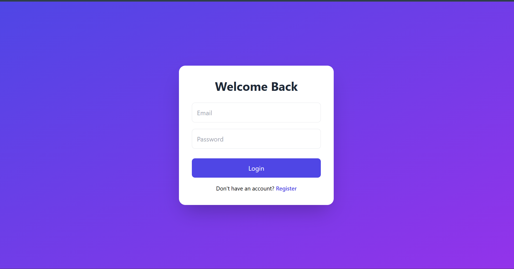
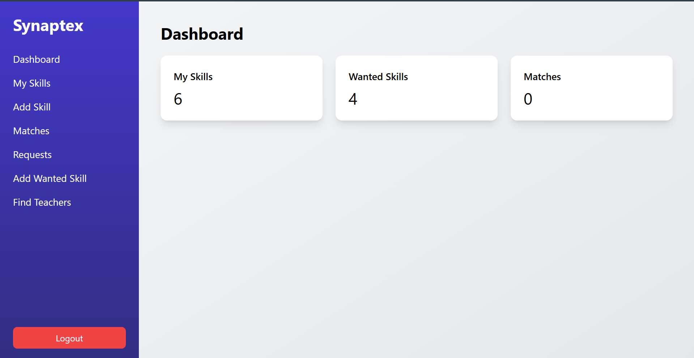
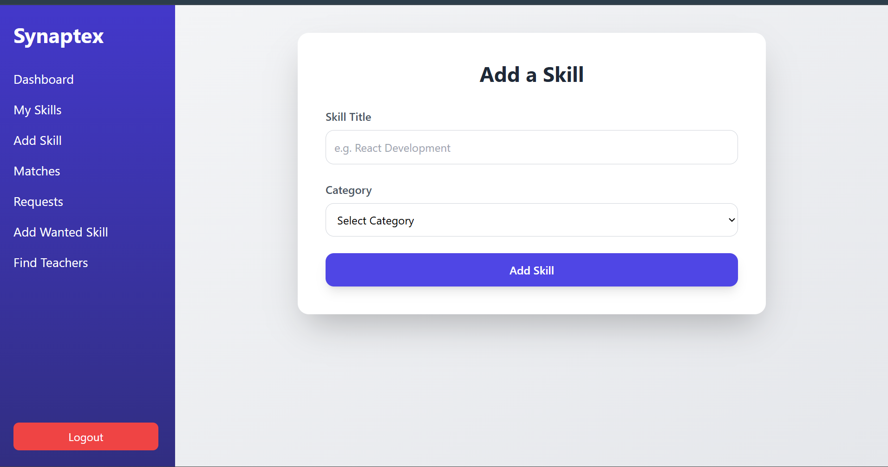
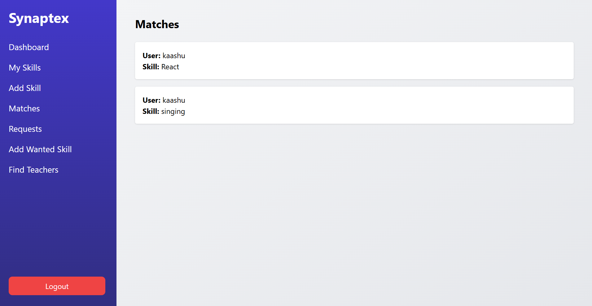
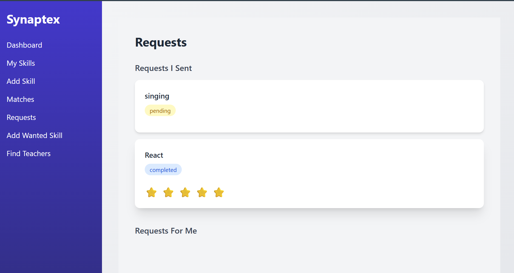
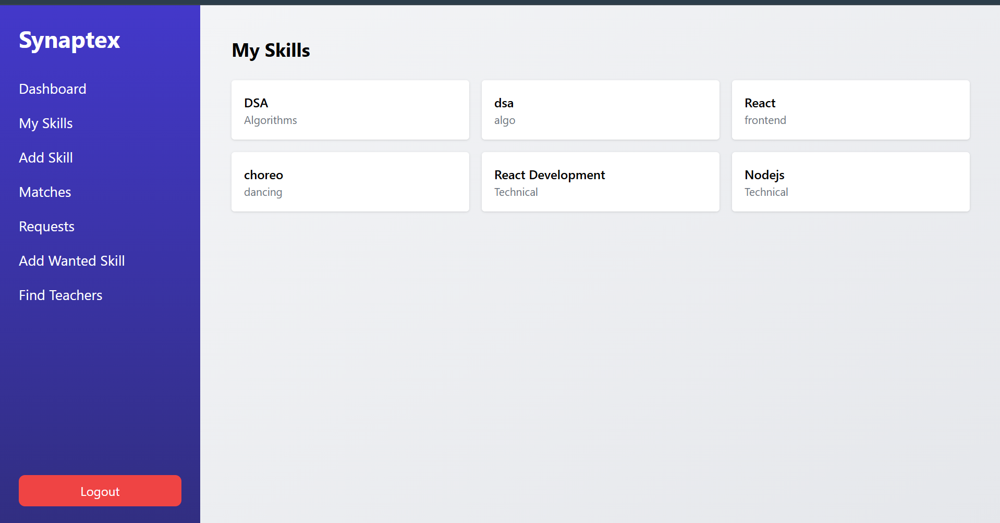
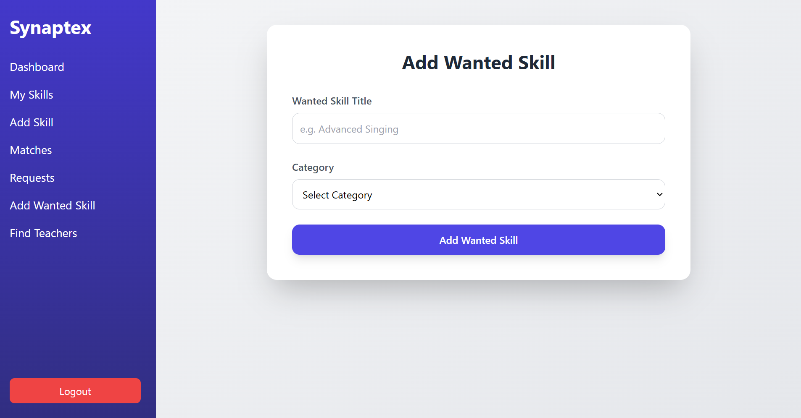
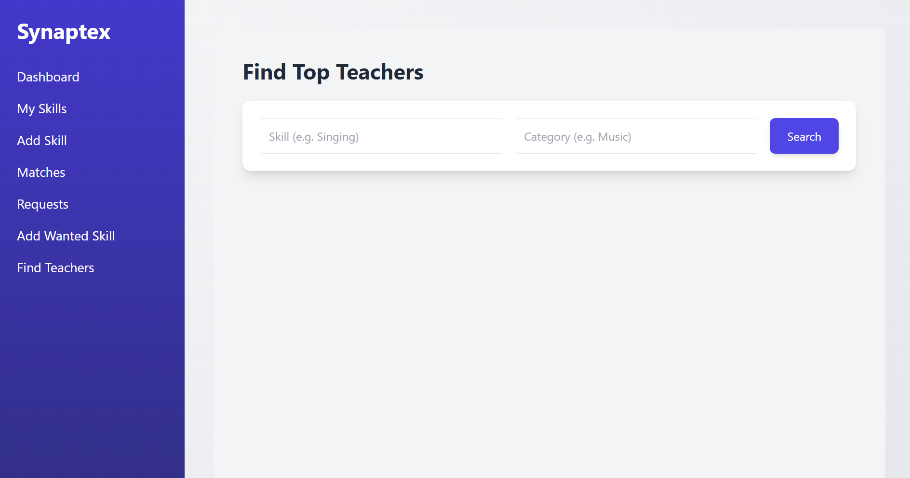

# Synaptex

## Demo Video

**Synaptex** is a full-stack skill exchange platform that enables people to **teach what they know and learn what they want** by connecting users with complementary skills.

Users can list skills they offer, add skills they want to learn, discover potential teachers, send requests, chat after acceptance, and rate each other once the exchange is completed.

The platform demonstrates a complete **end-to-end full-stack system including authentication, API design, relational data modeling, and production deployment.**

---

# Live Application

https://synaptexf.onrender.com

---

# Core Features

### Authentication
- Secure user registration and login
- JWT-based authentication
- Protected API routes

### Skill Marketplace
- Add skills you can teach
- Add skills you want to learn
- Categorize skills

### Matching System
- Detects mutual skill matches
- Connects users with complementary interests

### Request Workflow

Users interact through a structured request lifecycle:
# Synaptex

!(screenshots/demo.gif)

**Synaptex** is a full-stack skill exchange platform that enables people to **teach what they know and learn what they want** by connecting users with complementary skills.

Users can list skills they offer, add skills they want to learn, discover potential teachers, send requests, chat after acceptance, and rate each other once the exchange is completed.

The platform demonstrates a complete **end-to-end full-stack system including authentication, API design, relational data modeling, and production deployment.**

---

# Core Features

### Authentication
- Secure user registration and login
- JWT-based authentication
- Protected API routes

### Skill Marketplace
- Add skills you can teach
- Add skills you want to learn
- Categorize skills

### Matching System
- Detects mutual skill matches
- Connects users with complementary interests

### Request Workflow

Users interact through a structured request lifecycle:
Pending → Accepted → Completed

### Real-Time Chat
Users can communicate once a learning request is accepted.

### Rating System
After completing a skill exchange, users can rate each other.

### Production Deployment
Frontend and backend are deployed and accessible through a public URL.

---

# Screenshots

## Login

## Dashboard

## Add Skill

## Matches

## Requests

## My skills

## Add Wanted Sills

## Find Top Teachers

---

# Tech Stack

### Frontend
React.js  
React Router  
Tailwind CSS  
Framer Motion  

### Backend
Node.js  
Express.js  
REST API  

### Database
Prisma ORM  
SQL Database  

### Authentication
JWT (JSON Web Tokens)

### Deployment
Render

---

# System Architecture
Frontend (React)
↓
REST API (Express)
↓
Database (Prisma ORM + SQL)

---

# Project Structure

frontend/
├── src/
│ ├── components
│ ├── pages
│ └── api.js

backend/
├── controllers
├── routes
├── middleware
└── prisma

---

# Local Setup

Clone the repository
git clone https://github.com/Nayessha/synaptex.git

### Backend Setup
cd backend
npm install

Create `.env`

DATABASE_URL= my_db_url
JWT_SECRET= my_secret

Run server

---

### Frontend Setup

cd frontend
npm install
npm run dev

---

# Future Improvements

- User profile pages
- Skill recommendation system
- Notification system
- Advanced teacher search
- Improved matching algorithm

---
# Author

**Nayessha Marya**  
B.Tech CSE (AI/ML) – VIT Vellore
